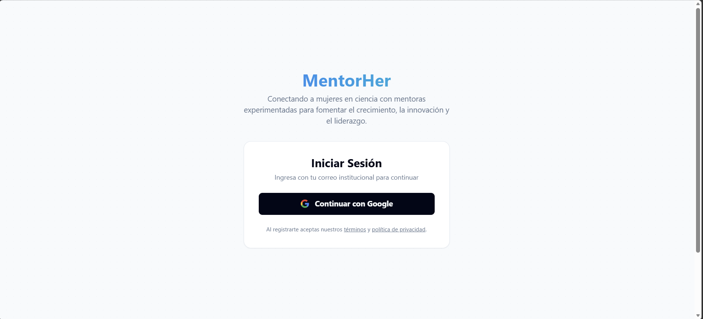
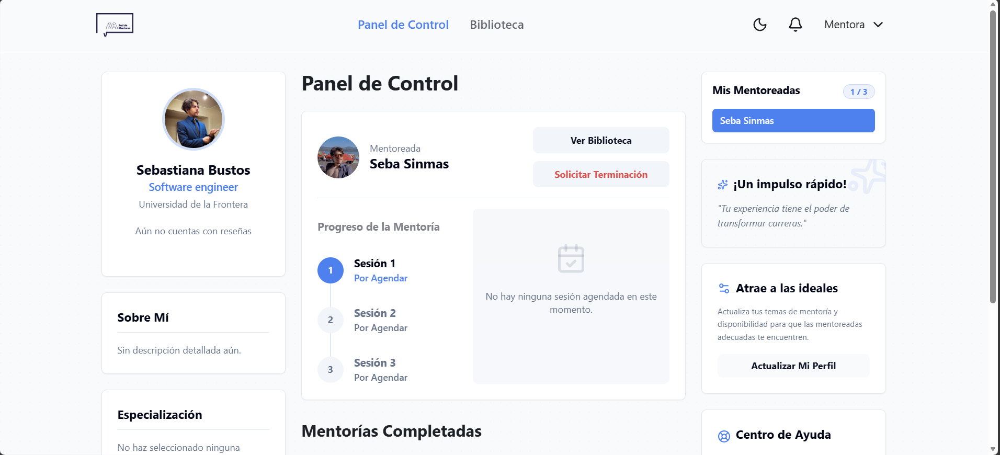
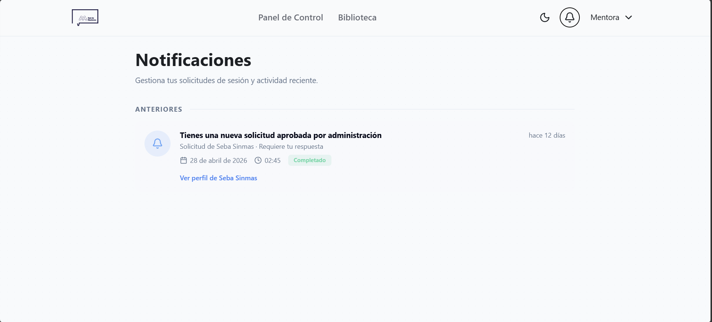

## Rol y alcance
Como usuario, migré completamente el entorno de desarrollo a Cachy-OS, una distribución de Linux basada en Arch. Mi trabajo abarcó desde la configuración del entorno de desarrollo hasta la implementación de arquitectura moderna con Next.js 16 y servidor WebSocket para la gestión de notificaciones en tiempo real.

## Arquitectura en capas
### Frontend:
Desarrollado con Next.js 16.1.6 y estilizado con Tailwind 4. Implementación de estado global para la sesión del usuario, protección de rutas por rol de acceso y formularios con validación accesible.

### Backend & Tiempo Real:
API REST con autenticación por token y validación estricta de payloads. Integración de un servidor WebSocket dedicado para manejar el flujo bidireccional de eventos y alertas.

### Datos:
Persistencia en PostgreSQL con migraciones versionadas. Diseño optimizado mediante índices en claves de alta concurrencia (búsquedas de usuarios, slots de agenda).

## Pantallas destacadas
### Acceso y primera impresión

La pantalla de login prioriza un contraste legible y feedback inmediato ante credenciales incorrectas o problemas de red.

### Panel principal

El dashboard actúa como el centro de control del usuario. Agrupa las próximas sesiones, accesos rápidos a mensajes directos y un resumen de actividad reciente sin saturar la carga cognitiva.

### Centro de Notificaciones

Alimentado por el servidor WebSocket, este listado actualiza los eventos en tiempo real. Utiliza jerarquía visual por tipo de alerta (recordatorio, mensaje, sistema) y gestiona de forma eficiente los estados de leído/no leído.

### Landing de producto

Sección pública centrada en la propuesta de valor y el CTA hacia el registro. Mantiene coherencia gráfica y de componentes con el área autenticada, aprovechando la reutilización de la UI.

### Notas de implementación

Los screenshots corresponden a iteraciones funcionales ya integradas en el entorno de staging. La documentación de estas decisiones de arquitectura en este portfolio permite exponer la lógica del negocio y la infraestructura subyacente sin depender de datos mockeados en el cliente.